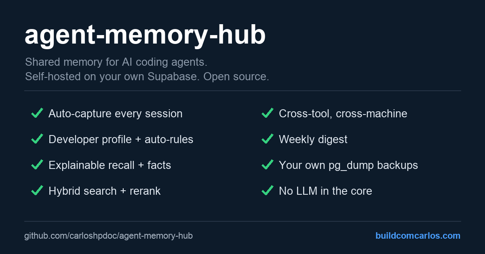
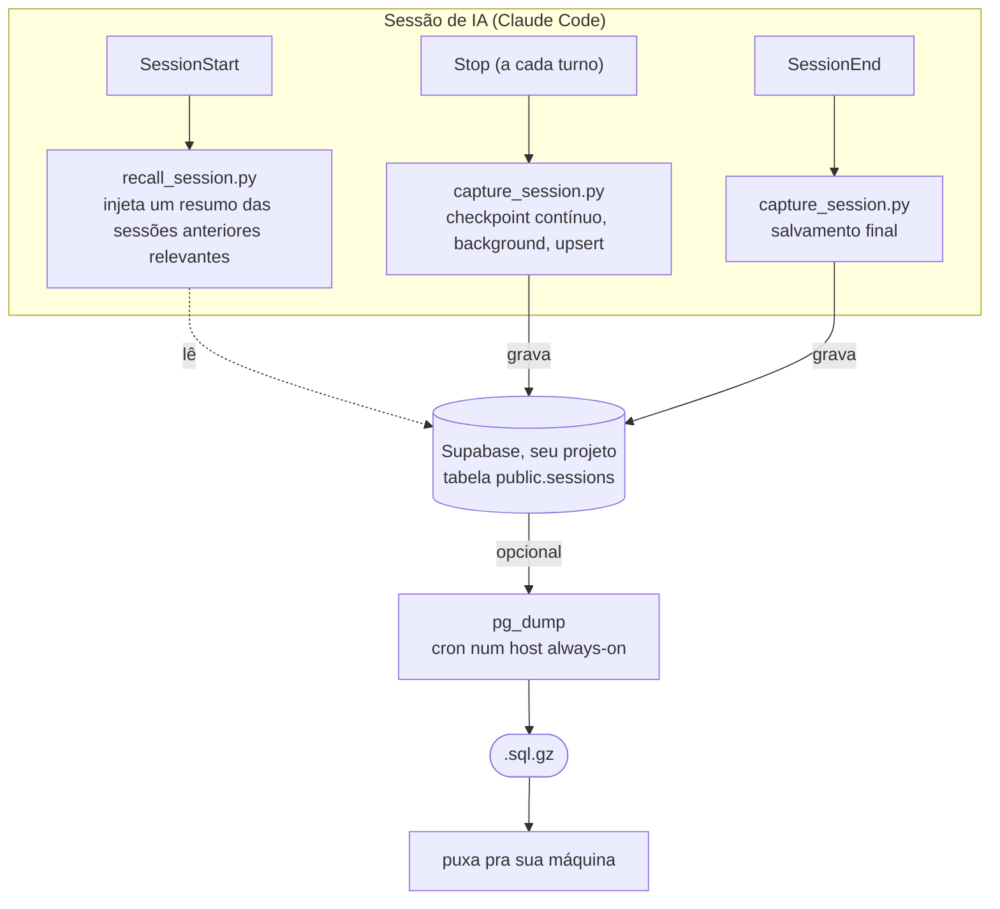

# agent-memory-hub

> 🇺🇸 Read in [English](README.md).



Memória **persistente e compartilhada para agentes de IA** de código (Claude Code, e qualquer
ferramenta com MCP/REST), guardada no **seu próprio Supabase**. Toda sessão é salva
automaticamente numa tabela Postgres e recuperada no início da próxima, atravessando
**sessões, instâncias e máquinas**.

Um princípio diferencia tudo: **memória em que você confia, que se explica, e que é sua**. Não uma caixa-preta.

- **Explicável.** O recall mostra a proveniência de cada item (do fato: confiança e idade; da
  sessão: o `session_id`), e a confiança de um fato **decai com o tempo**, então memória velha
  desbota sozinha.
- **Com humano no portão.** O perfil cross-projeto e suas regras são **propostos**, nunca
  aplicados sozinhos. Você aprova ou rejeita; nada reescreve em silêncio como o agente trabalha.
- **Seu.** Postgres puro no seu Supabase. `pg_dump` quando quiser. Sem SaaS no meio, zero lock-in.

## Por quê

O Claude Code começa cada sessão do zero. Ferramentas como claude-mem ou mem0 resolvem isso, mas
ou guardam local (sem cross-máquina) ou passam por um serviço hospedado, e a maioria **aplica
sozinha** o que extrai. O `agent-memory-hub` é a versão self-owned e auditável: uma tabela no
Supabase que é sua, camadas opcionais que você liga conforme precisa (busca semântica, fatos,
um perfil cross-projeto do dev, backups), e um humano no loop sempre que a memória muda como o
agente se comporta.

- **Cross-sessão / instância / máquina:** qualquer setup apontando pro mesmo Supabase compartilha tudo.
- **Destilado, não despejado:** o recall injeta contexto compacto, ranqueado e explicável, não transcript cru.
- **Auto-melhorante, nos seus termos:** aprende como você trabalha entre projetos e propõe regras; você decide.

## Features

- **Captura automática** de toda sessão, com checkpoint por turno que sobrevive a crash.
- **Recall** no início: um resumo de uma linha por sessão relevante, mais os **fatos** duráveis
  do projeto atual.
- **Busca** em todo o histórico: **híbrida** (keyword + semântico via `pgvector`), com
  **`--rerank`** opcional via LLM.
- **Camada de fatos** (opcional, bring-your-own-LLM): preferências / decisões / configs
  duráveis, com validade temporal, deduplicadas por significado.
- **Cross-ferramenta:** Claude Code via hooks, Codex CLI via adapter, qualquer ferramenta via o template.
- **Console de memória** (`scripts/memory.py`): navegue, busque e inspecione pelo terminal.
- **Backups seus:** `pg_dump` diário em `.sql` portável. Zero lock-in.
- **Sem LLM no núcleo** (a parte "semântica" usa modelo embarcado, não LLM de chat); cada peça
  com LLM é opcional e tem opção grátis.

## Como funciona



- A captura é **idempotente** (upsert por `session_id`). O checkpoint do `Stop` faz com que
  até um kill abrupto preserve a sessão até o último turno.
- O recall injeta só um **resumo compacto** (uma linha extrativa por sessão, não o transcript
  cru). Os transcripts completos ficam disponíveis sob demanda via Supabase MCP ou REST.
- O resumo é **determinístico e sem LLM**: o hook guarda a primeira pergunta substantiva, a
  última e os contadores de turnos. Rode `sql/04-summary.sql` para adicionar a coluna.

## Requisitos e ferramentas suportadas

A memória em si é só Postgres, então o que é específico de ferramenta é apenas a captura e o
recall automáticos, que vêm como hooks do Claude Code.

- **Captura + recall automáticos (os hooks):** [Claude Code](https://claude.com/claude-code).
  Os hooks usam os eventos `SessionStart`, `Stop` e `SessionEnd`.
- **Ler e consultar a memória compartilhada:** qualquer ferramenta de IA com MCP ou REST,
  por exemplo Cursor, Codex CLI, Gemini CLI ou ChatGPT, via Supabase MCP ou a REST API.
- **Capturar de outra ferramenta:** aponte o ciclo de vida dela (ou um passo manual) pro
  mesmo endpoint REST. O `capture_session.py` é pequeno; adaptar pro formato de transcript de
  outra ferramenta é tranquilo, e contribuições são bem-vindas.

Também precisa:

- Um projeto [Supabase](https://supabase.com) (free tier).
- `python3` (hooks e backup são stdlib puro, sem pip).

## Começando (e: como configurar em outra máquina)

> **Atalho:** depois de clonar e preencher o `.env`, rode `./scripts/setup.sh`. Ele aplica as
> migrações SQL e instala os hooks do Claude Code num passo só (idempotente; não liga a camada
> opcional de fatos com LLM). Os passos manuais abaixo explicam o que ele faz.

### 1. Clone
```bash
git clone https://github.com/carloshpdoc/agent-memory-hub.git
cd agent-memory-hub
```

### 2. Crie um projeto Supabase
Em [supabase.com](https://supabase.com): novo projeto. Ative **Data API** e **RLS**.
Pegue em **Settings > API**: Project URL, publishable key, secret key.

### 3. Aplique o schema
Abra o **SQL Editor** no Supabase e rode [`sql/01-schema.sql`](sql/01-schema.sql).
Ele cria a tabela `sessions`, o índice full-text e o RLS.

### 4. Configure o `.env`
```bash
cp .env.example .env
# edite o .env com seu SUPABASE_URL e SUPABASE_SECRET_KEY (e as vars de backup, se usar)
```
O `.env` é gitignored. Os hooks leem dele direto.

### 5. Ligue os hooks no Claude Code
Adicione no seu `settings.json` (`~/.claude/settings.json` para escopo user), usando o
**caminho absoluto** do seu clone:

```json
{
  "hooks": {
    "SessionStart": [
      { "matcher": "", "hooks": [
        { "type": "command", "command": "python3 /CAMINHO/ABS/agent-memory-hub/hooks/recall_session.py", "timeout": 15 }
      ]}
    ],
    "Stop": [
      { "matcher": "", "hooks": [
        { "type": "command", "command": "payload=$(cat); echo \"$payload\" | python3 /CAMINHO/ABS/agent-memory-hub/hooks/capture_session.py >/dev/null 2>&1 &" }
      ]}
    ],
    "SessionEnd": [
      { "matcher": "", "hooks": [
        { "type": "command", "command": "python3 /CAMINHO/ABS/agent-memory-hub/hooks/capture_session.py", "timeout": 20 }
      ]}
    ]
  }
}
```
> Se você já tem hooks nesses eventos, **acrescente** estas entradas aos arrays existentes.

### 6. (opcional) Adicione o Supabase MCP
Deixa o agente consultar as memórias de forma interativa:
```bash
claude mcp add --scope user --transport http supabase \
  "https://mcp.supabase.com/mcp?project_ref=<SEU_PROJECT_REF>"
# depois autentique: /mcp > supabase
```

### 7. (opcional) Módulo de backup
Num host always-on com `pg_dump` igual ou acima da versão major do seu Postgres, e o repo clonado:
- Coloque as credenciais do pooler no `~/.pgpass` (chmod 600):
  `HOST:5432:postgres:postgres.<PROJECT_REF>:SENHA`
- Preencha as vars `PG_POOLER_*` no `.env`.
- Cron: `30 3 * * * /CAMINHO/ABS/agent-memory-hub/scripts/backup.sh >> .../backup.log 2>&1`
- Puxe cópias pro local com `scripts/pull-backups.sh` (defina `REMOTE_SSH` e `SSH_KEY` no `.env`).

## Configurando em outra máquina

É o ponto central, e é trivial:

1. Clone o repo na nova máquina.
2. Copie o **mesmo `.env`** (mesmas credenciais Supabase).
3. Rode `./scripts/setup.sh`.

Pronto. Essa máquina passa a gravar e ler na **mesma memória compartilhada**. As migrações são
idempotentes (e puladas se ela não tiver credenciais de banco, já que o schema é compartilhado).
A camada de fatos fica desligada, então uma máquina mais fraca só captura e lê, enquanto a
extração pesada de fatos roda só onde você habilitar.

Para também subir o histórico **anterior** do Claude Code daquela máquina (sessões de antes dos
hooks), rode `python3 scripts/backfill_sessions.py --dry-run` para prever, depois sem a flag para
enviar. É idempotente (pula as sessões que já estão no Supabase).

## Capturar de outras ferramentas (adapters)

Os hooks do Claude Code são um caminho de captura. Ferramentas sem hooks de ciclo de vida são
cobertas por um **adapter** que varre os transcripts locais delas e sobe os novos (idempotente),
igual ao `backfill_sessions.py`. Os adapters rodam num cron e gravam com `tool=<nome>`, então
recall, busca e fatos tratam todas as ferramentas igual.

- **Codex CLI** ([`scripts/adapters/codex.py`](scripts/adapters/codex.py)) lê
  `~/.codex/sessions/**/rollout-*.jsonl`. Rode com `--dry-run` para prever, depois ponha num cron.
- **Adicionar uma ferramenta:** escreva um adapter pequeno que mapeie os transcripts dela para
  `(session_id, cwd, turnos user/assistant)` e faça upsert com `tool=<nome>`. Use o `codex.py` como
  template. Cursor (chat em SQLite) e Gemini CLI são boas primeiras contribuições.

## Referência de configuração

| Var | Usada por | Significado |
|-----|-----------|-------------|
| `SUPABASE_URL` | hooks, backup.py | `https://<ref>.supabase.co` |
| `SUPABASE_SECRET_KEY` | hooks | service_role key (escreve, ignora RLS) |
| `PG_POOLER_HOST`, `PG_POOLER_USER` | backup.sh | host do Session Pooler, `postgres.<ref>` |
| `BACKUP_DIR`, `KEEP` | backup.sh, backup.py | diretório de saída, quantos manter |
| `REMOTE_SSH`, `SSH_KEY` | pull-backups.sh | host always-on, chave SSH |
| `EMBED_KEY` | embed_pending.py, search.py | guard da função de embeddings (Fase 2) |

## Consultando sua memória

- **Console:** `python3 scripts/memory.py` abre um prompt interativo, ou use como subcomandos:
  `stats`, `recent [N]`, `search [--project P] "<q>"`, `facts [projeto]`, `show <id>`. Stdlib
  puro, sem servidor, sem key num browser.
- **MCP:** peça ao agente. Ele roda SQL via Supabase MCP.
- **REST full-text:** `GET /rest/v1/sessions?content_tsv=fts(simple).<termo>` com a secret key.
- **Filtros:** por `project`, `machine`, `started_at`, `session_id`.

## Busca semântica (Fase 2)

Opcional. Adiciona recall por significado em cima do full-text, usando `pgvector` e o modelo
`gte-small` rodando dentro de uma Supabase Edge Function (grátis, sem API externa).

1. Rode [`sql/02-phase2-pgvector.sql`](sql/02-phase2-pgvector.sql). Adiciona a coluna
   `embedding`, o índice HNSW e a RPC `match_sessions`. Rode também
   [`sql/03-hybrid-search.sql`](sql/03-hybrid-search.sql) para a RPC `hybrid_search`.
2. Defina um segredo de guard e faça deploy da função:
   ```bash
   supabase secrets set EMBED_KEY=$(openssl rand -hex 24)
   supabase functions deploy embed --no-verify-jwt   # as keys novas não são JWT
   ```
   Coloque a mesma `EMBED_KEY` no seu `.env`.
3. Embede as linhas existentes: `python3 scripts/embed_pending.py`. Rode num cron pra manter
   novas sessões embedadas (ex.: `*/15 * * * *` no seu host always-on).
4. Busque: `python3 scripts/search.py "como configuramos o backup"`. Roda **hybrid search**
   (keyword + semântico, fundidos com Reciprocal Rank Fusion), então termos exatos que a
   busca vetorial pura perderia ainda aparecem, e vice-versa. Adicione `--rerank` para um
   segundo passe opcional via LLM que reordena os top candidatos por relevância (precisa de `FACTS_LLM`).

A Edge Function devolve só vetores e contadores, nunca o conteúdo das sessões.

## Fatos e preferências (opcional, Fase 4)

Tudo acima funciona **sem nenhuma LLM** (a parte "semântica" usa o `gte-small` embarcado, não
um modelo de chat). Esta camada opcional é a única que usa LLM, e é **bring-your-own-LLM com
opções grátis**, então nunca força custo nem um provedor específico.

Quando ligada, um cron opcional destila cada sessão em fatos atômicos duráveis (preferências,
decisões, configs) com validade temporal, deduplicados por significado. O recall passa a
injetar os fatos relevantes (projeto atual + globais) no topo do digest.

1. Rode [`sql/05-facts.sql`](sql/05-facts.sql) (tabela de fatos, modelo de validade, RPC `match_facts`).
2. Escolha um provedor no `.env` via `FACTS_LLM`:
   - `ollama`: local, grátis, privado (precisa do Ollama rodando).
   - `gemini`: free tier do Google AI Studio (`GEMINI_API_KEY`).
   - `openai`: OpenAI ou qualquer endpoint compatível (Groq, OpenRouter, local).
   - `off` (default): desligado; o resto da ferramenta não muda.
3. Rode `python3 scripts/extract_facts.py` (coloque num cron pra processar novas sessões).

## Segurança

- Segredos só no `.env` e `~/.pgpass` (gitignored, chmod 600). Nunca commite.
- RLS ligado. A key pública (anon) não lê sem política. Os hooks usam a secret key.
- A secret key é poderosa. Trate como senha.

## Licença

[MIT](LICENSE)

## Star, compartilhe, contribua

Se isso te poupou de re-explicar seu projeto pro agente pela décima vez hoje, dá uma star no
repo. Ajuda de verdade outras pessoas a encontrarem.

Ideias, arestas, ou um adapter de captura pra sua ferramenta (Cursor, Gemini CLI...)? Abra uma
issue ou um pull request. Se você construir algo em cima do agent-memory-hub, vou adorar ver.

## Feito por

Feito por **[buildcomcarlos.com](https://buildcomcarlos.com)**: artigos e ferramentas open
sobre agentes de IA, iOS e shipar software sozinho. Se esse projeto foi útil, o site é onde
ficam os deep dives e os próximos experimentos. Aparece lá.
